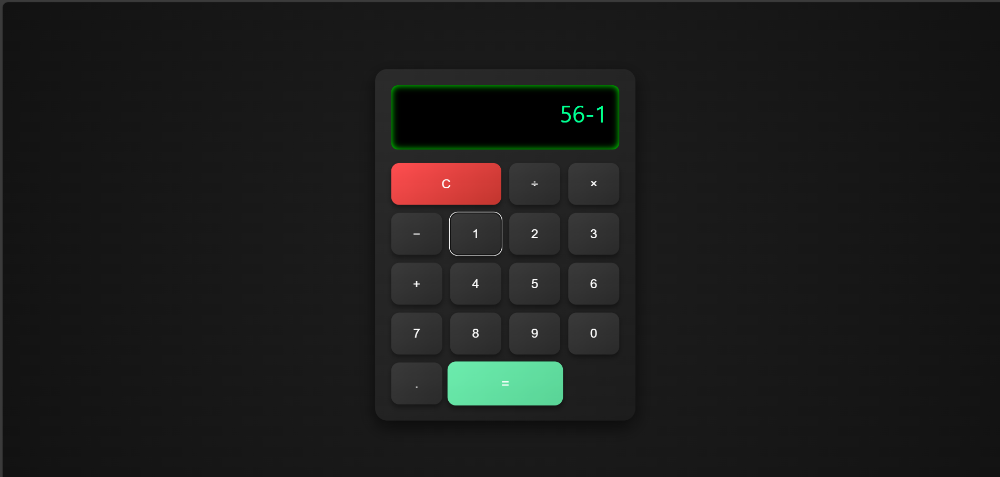

# 🔢 React Calculator

This is a simple yet functional calculator built using **React.js**. It supports basic arithmetic operations such as addition, subtraction, multiplication, and division. Designed with a clean and responsive user interface, the calculator showcases React fundamentals including state management, component structure, and event handling. This project is perfect for beginners looking to understand how React can be used to create interactive web applications.
## 📸 Screenshots

Below are some screenshots of the Online Calculator:

### 🏠 Home Page

